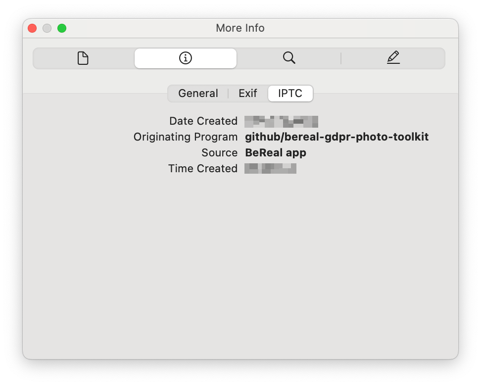

# bereal-gdpr-photo-toolkit
When you request your data from BeReal, you receive a ZIP file containing all the photos in WebP format. These files unfortunately don't contain any metadata such as when the photo was taken. This information is stored in a JSON file, which is great for processing the data but not easily human readable. 

The script `process-photos.py` automates the process of converting the images to JPEG, along with renaming and updating the EXIF data using the information from the JSON file

# Prerequisites
## Request your data
Request your data according to Article 15 GDPR by using the in app chat. You can generate a template using [datarequests.org](https://www.datarequests.org/generator/).

## Install Python libraries
To run this script, you'll need Python installed on your system along with the following libraries:

- Pillow (PIL Fork)
- piexif
- iptcinfo3

You can install these libraries using pip:

```console
pip install Pillow piexif iptcinfo3
```


# Running the Script
Before running the script, make sure you have the required files. Place the script in the same directory as the JSON file named `posts.json`.

To run the script, navigate to the directory containing the script:

```console
cd path_to_unzipped_folder
```

Then execute it with Python:

```console
python process-photos.py
```

# Features
## Image Combine Logic

The script includes an option to combine the primary and secondary images into a single image, simulating the appearance of original BeReal memories. Using Pillow, the secondary image is resized and positioned on top of the primary image, with its corners rounded and an outline added.

The values used are:

```python
corner_radius = 60 # radius for the rounded corners
outline_size = 7 # thickness of the black outline
position = (55, 55) # margin to the borders
```
Adjust values if you want a different look or place the image in a different corner.

## Adding EXIF and IPTC tags
The script adds additional tags to the converted images. Currently these tags are supported:
- geolocation
- caption

On top of that, there is some static information added to the metadata, in order to help with referencing where the image came from. This information is:
```python
source = "BeReal app"
originating program = "github/bereal-gdpr-photo-toolkit"
```

When opening the image, this static information can look like this:


## Advanced settings

By default, the script converts images to JPEG, drops the original filenames from the converted filenames and creates the combined images. Users have the ability to customize how the script behaves through a series of prompts:

1. Conversion to JPEG: Choose whether to convert WebP images to JPEG format.
2. Filename Preservation: Decide whether to keep the original filename within the new filename structure.
3. Image Combination: Opt in or out of combining primary and secondary images.

# Data Requirement
The script processes images based on data provided in a JSON file obtained from BeReal. The JSON file should follow this format:

```json
[
  {
    "primary": {
      "path": "/path/to/primary/image.webp",
      "other": "data"
    },
    "secondary": {
      "path": "/path/to/secondary/image.webp",
      "other": "data"
    },
    "takenAt": "YYYY-MM-DDTHH:MM:SS.sssZ",
    "other": "data"
  }
]
```
